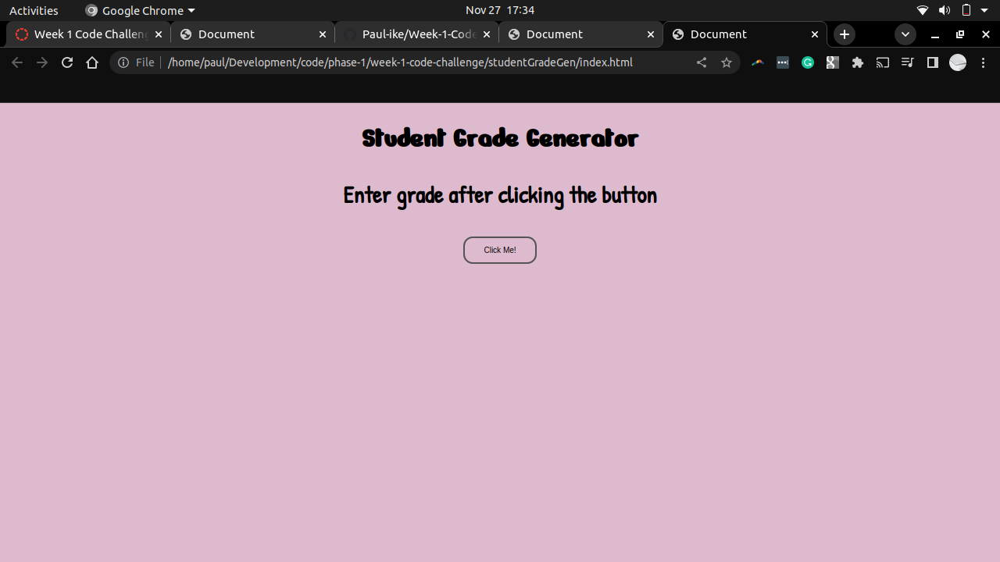
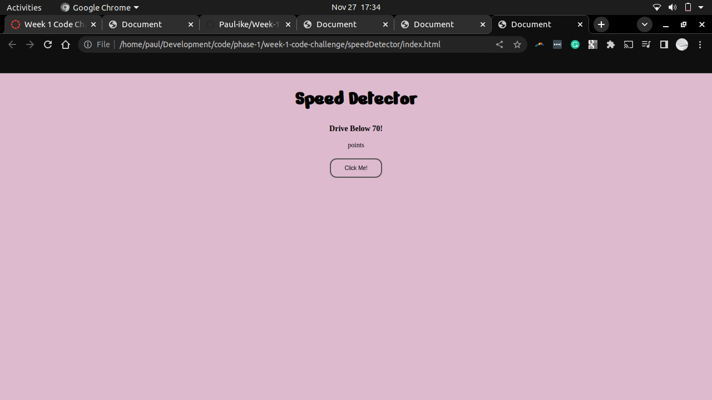
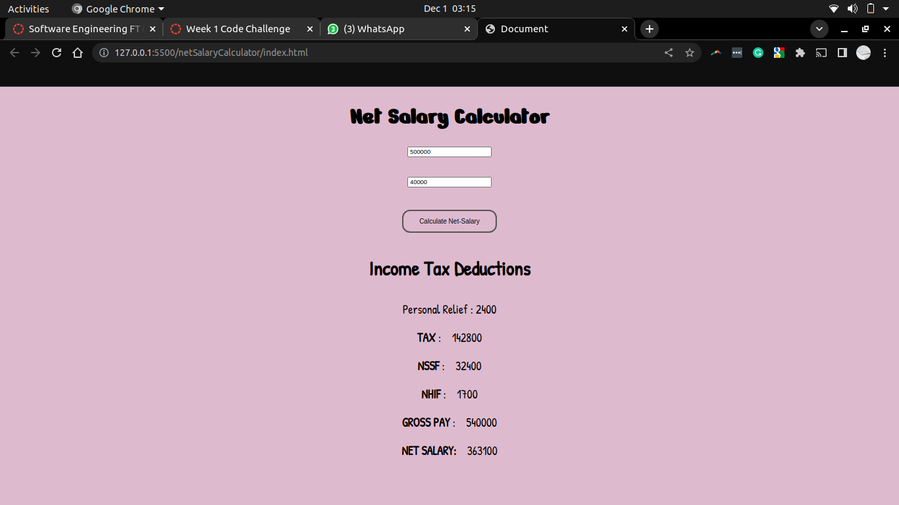

### WEEK 1 CODE CHALLENGE
#### STUDENT GRADE GENERATOR
    - TOPIC
    - ENTER STUDENT MARKS
    - CLICK BUTTON
    - GENERATE GRADE
#### SPEED DETECTOR
    - TOPIC
    - ENTER SPEED 
    - CLICK BUTTON
    - GENERATE OUTPUT
#### NET SALARY CALCULATOR
    - TOPIC
    - ENTER SALARY AND BENEFITS
    - CLICK BUTTON
    - GENERATE OUTPUT

